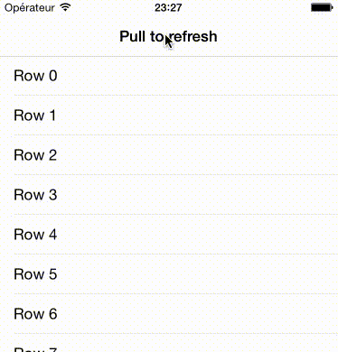

# README
MAGearRefreshControl is a fully customizable iOS refresh control with gear animation for tableview refresh, writen in Swift.

##**Edit from 23/06/15:**

An intermediate class, `MAAnimatedMultiGearView`, was added in order to animate rotation without having to use an
`MAGearRefreshControl` object.

##**Credits:**

This project is inspired by this [dribble post](https://dribbble.com/shots/1974767-gear-powered-pull-to-refresh-animation).
The main structure of the refresh Control is based on [EGOTableViewPullRefresh](https://github.com/enormego/EGOTableViewPullRefresh).

##**How to use:**

###Contents:###
MAGearRefreshControl is made of four base classes you can use as you wish :

* **MAGear** :  This class represents a gear in the most abstract way, without any graphical code related.
* **MASingleGearView** : This `UIView` subclass is used to draw a gear.
* **MAMultiGearView** : This `UIView` subclass is used to draw multiples gears.
* **MAAnimatedMultiGearView** :  This `MAMultiGearView` subclass is used to draw and animate multiple gears
* **MAGearRefreshControl** : This `MAAnimatedMultiGearView` subclass is used to draw multiples gears and offers the same interactions as an `UIRefreshControl`.

###Refresh control###

`MAGearRefreshControl` must be used from an `UITableViewController` subclass or `UIViewController` subclass.

    refreshControl = MAGearRefreshControl(frame: CGRectMake(0, -self.tableView.bounds.height, self.view.frame.width, self.tableView.bounds.height))
    refreshControl.backgroundColor =  UIColor.initRGB(34, g: 75, b: 150)
    refreshControl.addInitialGear(nbTeeth:12, color: UIColor.initRGB(92, g: 133, b: 236), radius:16)
    refreshControl.delegate = self
    self.tableView.addSubview(refreshControl)

You can add new gears easily with a single method :

    refreshControl.addLinkedGear(0, nbTeeth:16, color: UIColor.blurColor(), angleInDegree: 30)
    refreshControl.addLinkedGear(0, nbTeeth:32, color: UIColor.redColor(), angleInDegree: 190)

Now you have to respect the `MAGearRefreshDelegate` protocol :

    // Method called to know if the data source is loading or no
    func MAGearRefreshTableHeaderDataSourceIsLoading(view: MAGearRefreshControl) -> Bool {
        return isLoading
    }

    // Method called when the pull to refresh move was triggered.
    func MAGearRefreshTableHeaderDidTriggerRefresh(view: MAGearRefreshControl) {
        refresh()
    }

The refresh control must be notified of scrolling events and when the data is loaded using `MAGearRefreshScrollViewDidEndDragging`, `MAGearRefreshScrollViewDidScroll`and `MAGearRefreshScrollViewDataSourceDidFinishedLoading` methods. The sample project illustrate when to call these methods.

##**Licence:**

MAGearRefreshControl is under MIT Licence so you can use/modify it as you wish. Any feedback will be appreciated.

##**Contact:**

[@micazeve](https://twitter.com/micazeve)  
micazeve@gmail.com
