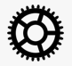

# README
[](http://cocoapods.org/pods/MAGearRefreshControl)
[](http://cocoapods.org/pods/MAGearRefreshControl)
[](http://cocoapods.org/pods/MAGearRefreshControl)

MAGearRefreshControl is a fully customizable iOS refresh control with gear animation for tableview refresh, writen in Swift.


## **Edit from 20/02/17:**

This component is now compatible with Swift 3.0. The `swift-2.0` branch is still available.

## **Edit from 16/11/15:**

A new enum, `MAGearStyle`, was added in order to custom single gears within the gear group.

* `.Normal` : Full gear, the one you knew from the beginning :)
* `.Branched`: Gear with branchs inside of it. Since it's difficult to describe, a picture will help :



Now you can easily add your own gear styles and I will gladly merge them.

## **Edit from 23/06/15:**

An intermediate class, `MAAnimatedMultiGearView`, was added in order to animate rotation without having to use an
`MAGearRefreshControl` object.

## **Credits:**

This project is inspired by this [dribble post](https://dribbble.com/shots/1974767-gear-powered-pull-to-refresh-animation).
The main structure of the refresh Control is based on [EGOTableViewPullRefresh](https://github.com/enormego/EGOTableViewPullRefresh).

## **How to use:**

### Contents:
MAGearRefreshControl is made of five base classes you can use as you wish :

* **MAGear** : This class represents a gear in the most abstract way, without any graphical code related.
* **MASingleGearView** : This `UIView` subclass is used to draw a gear.
* **MAMultiGearView** : This `UIView` subclass is used to draw multiples gears.
* **MAAnimatedMultiGearView** :  This `MAMultiGearView` subclass is used to draw and animate multiple gears
* **MAGearRefreshControl** : This `MAAnimatedMultiGearView` subclass is used to draw multiples gears and offers the same interactions as an `UIRefreshControl`.

### Refresh control

`MAGearRefreshControl` must be used from an `UITableViewController` subclass or `UIViewController` subclass with an `UITableView`. Examples are provided for both cases.

```objective-c
refreshControl = MAGearRefreshControl(frame: CGRect(x: 0, y: -self.myTableView.bounds.height, width: self.view.frame.width, height: self.myTableView.bounds.height))
    refreshControl.backgroundColor =  UIColor.initRGB(34, g: 75, b: 150)
    _ = refreshControl.addInitialGear(nbTeeth:12, color: UIColor.initRGB(92, g: 133, b: 236), radius:16)
    refreshControl.delegate = self
    self.tableView.addSubview(refreshControl)
```

You can add new gears easily with a single method :
```objective-c
    _ = refreshControl.addLinkedGear(0, nbTeeth:16, color: UIColor.blue, angleInDegree: 30)
    _ = refreshControl.addLinkedGear(0, nbTeeth:32, color: UIColor.red, angleInDegree: 190)
    
    // Gear with branch style :
    refreshControl.addLinkedGear(1, nbTeeth:14, color: yellowColor(), angleInDegree: 20, gearStyle: .WithBranchs)
    
    // Gear with branch style and custom number of branchs:
    refreshControl.addLinkedGear(1, nbTeeth:45, color: greenColor(), angleInDegree: -50, gearStyle: .WithBranchs, nbBranches:12))
```

Now you have to respect the `MAGearRefreshDelegate` protocol :

 ```objective-c
   // Method called to know if the data source is loading or no
    func MAGearRefreshTableHeaderDataSourceIsLoading(_ view: MAGearRefreshControl) -> Bool {
        return isLoading
    }

    // Method called when the pull to refresh move was triggered.
    func MAGearRefreshTableHeaderDidTriggerRefresh(_ view: MAGearRefreshControl) {
        refresh()
    }
```

The refresh control must be notified of scrolling events and when the data is loaded using `MAGearRefreshScrollViewDidEndDragging`, `MAGearRefreshScrollViewDidScroll`and `MAGearRefreshScrollViewDataSourceDidFinishedLoading` methods. The sample project illustrate when to call these methods.


## **Licence:**

MAGearRefreshControl is under MIT Licence so you can use/modify it as you wish. Any feedback will be appreciated.


## **Contact:**

[@micazeve](https://twitter.com/micazeve)  
micazeve@gmail.com
